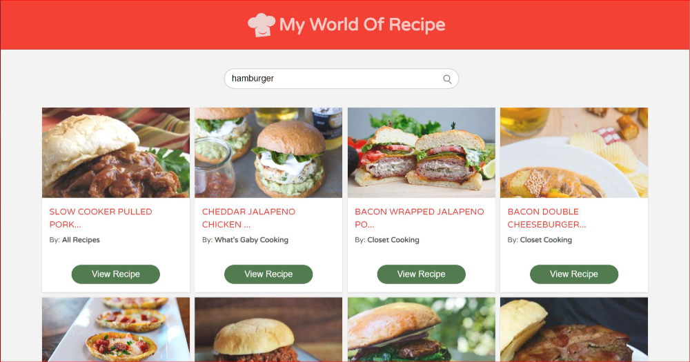

# My World Of Recipe

My last mintues personal, learning and experimental project using async/await/fetch method to fetch API key from [food2fork](https://www.food2fork.com). Comparing and gain new knowledge about async/await/fetch compared to Axios and Promise using react component lifecycle. 

- This project is bootstrapped with [Create React App](https://github.com/facebook/create-react-app) 2.0. 
- Layout were designed simple and quick using sass/css based grid and flex (no css bootstrap). 
- The logo were orginally designed by me. 

